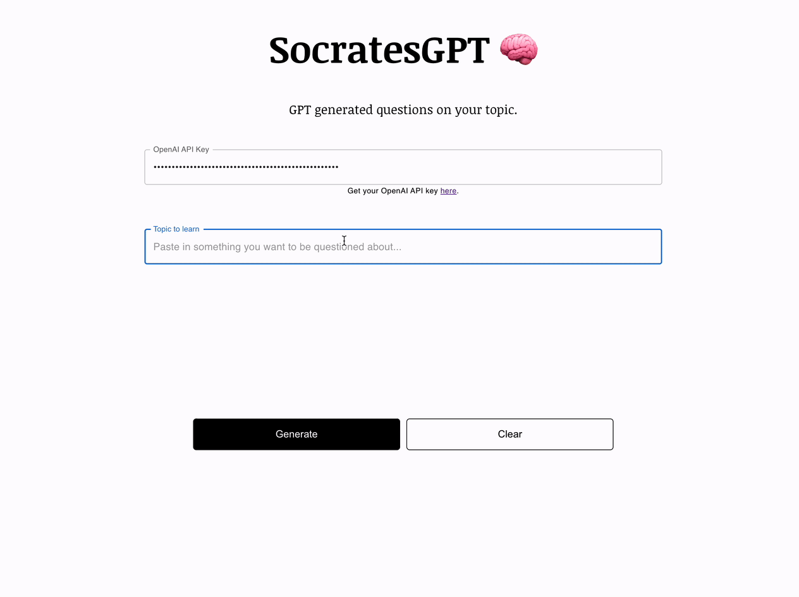

# SocratesGPT
### Text you want to learn → Questions about the text

_this is a toy project_

SocratesGPT generates questions about a given text. Pass in the synopsis of your favorite book, a passage from a confusing Wikipedia page, or a short article to generate a series of questions about the text.

The [testing effect](https://en.wikipedia.org/wiki/Testing_effect) shows that testing yourself on material you're trying to learn is one of the best ways to retain information. LLMs have the potential to help us become more effective learners. 

## How does it work?
The entire "backend" of this app is a prompt, found in `public/prompts/data.prompt`. We ask the model to impersonate Socrates, and generate questions based on the given text. We also provide a data model it should use to return the response in, which includes the source text, generated questions, and options, in JSON format. We're then able to parse the json and render it in the React front end. If you ask for another question, we update the prompt with the previous state of questions already asked and options selected and pass it back to the model.

Creating a traditional backend to power an app like this without the use of LLMs would be highly non-trivial. 

## Issues
- If you provide a very short text, the model can start generating questions that are not grounded in the text. For example, if the text is "The sky is blue", the model might generate a question like "Why is the sky blue?" despite the reason not being provided in the text.
- Sometimes the model seems to "undo" changes in state. For example, a question might get removed from state on the next run.
- It can take up to 20 seconds to receive a response from the API.

These issues and limitations show some of the weaknesses of LLMs. These make LLM based backends currently unsuitable for production applications that require low latency and deterministic output, but they are still useful for prototyping and exploring the capabilities of LLMs. These are still early days.

## Setup
1. Run `npm install` to download required dependencies
2. Enter your `OPENAI_API_KEY` in `src/App.js`, or pass it in to the UI
3. Run `npm run start`. SocratesGPT should open up in a new browser tab.

## Credits
Shout out to https://github.com/varunshenoy/GraphGPT for the inspiration.
